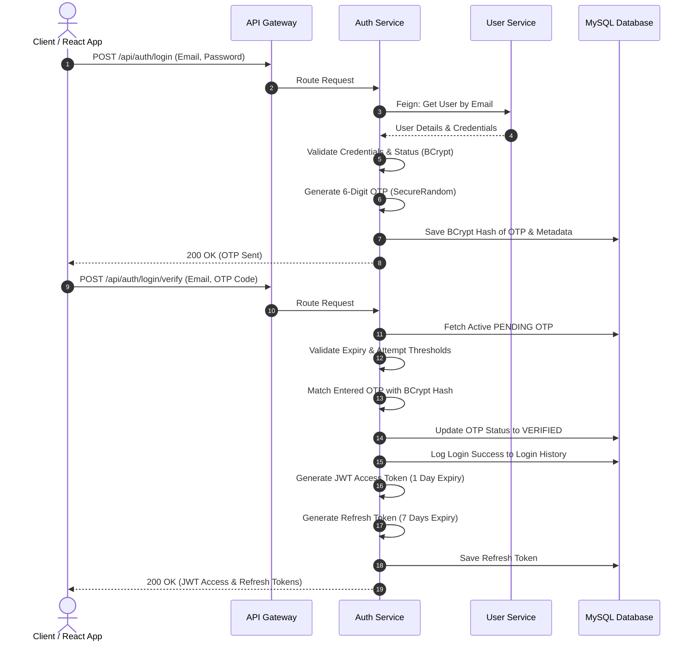

# Authentication Flow Documentation

This document describes the banking-grade 2-step multi-factor authentication (MFA) flow implemented in the MicroLend enterprise microservices application.

## High-Level Flow Chart

## Security Best Practices
- **No JWT on Registration**: JWT tokens are only issued after completing both Password validation and OTP verification.
- **Secure Password Hashing**: Passwords are saved hashed using BCrypt.
- **Secure OTP Hashing**: Plaintext OTP codes are never stored. Only their BCrypt hashes are saved in the database.
- **Zero Redis Dependency**: The application utilizes high-performance MySQL indexing for transactional OTP verification, resolving container overhead and reliability issues.
